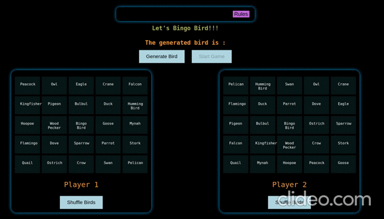

# Bingo Bird

### Create A bingo game by clicking the button and `show Birds`.

- When clicking the button, one random bird will appear on our screen. there are 24 different birds and one free slot on the middle called Bingo Bird which never changes.
- Once the generated random bird appears and the name of the bird is also available in our card then it `matches`
- You can shuffle the cards many times before the `game starts`.
- Either player or both player will win, if all the birds on the row column or diagonal `matches`
- Rules and Instructions component is also created and can be read during playing the game. `show` and `hide` the component is also possible.
- Enjoy the game
- Since Game is responsive for Desktop Tablets and Mobiles no extra queries are required.

### Technologies

- **_React_**
- **_Styled Components_**

### Live Preview
https://bingo-bird.vercel.app/
